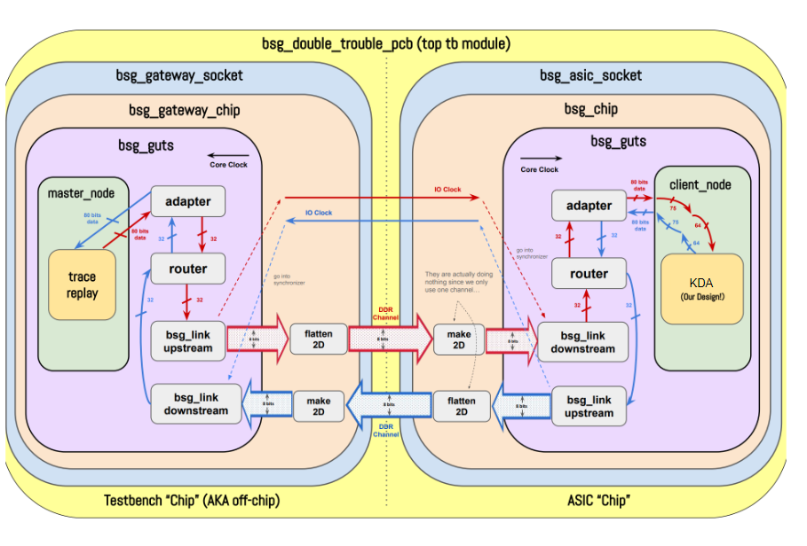

# OpenPBKDF2
An open-source ASIC implementation of the PBKDF2 algorithm using SHA256 encryption

Authors: Davis Sauer, Eli Orona

## Development Log: 
Proposal
- https://www.youtube.com/watch?v=NauiHZyn6Ak

Demo 1
- https://www.youtube.com/watch?v=NauiHZyn6Ak

Demo 2
- https://youtu.be/THS_AII5xEg

Demo 3
- https://youtu.be/pvE8ix76I0A

Final Presentation
- https://www.youtube.com/watch?v=zfRz6UrT6so

## Architecture
### BSG_CHIP TOP MODULE

### KDA MODULE

### PBKDF2 CHUNK MODULE

### HMAC_SHA256 MODULE

## Limitations/Future Work 
- Maximum size of input password is 64 characters and maximum salt size is 55 characters
- Only supports HMAC_SHA256. Additional hashing algorithm options would make the chip more versatile
- Only supports output hash sizes of 32, 64, 96, 128 bytes. This could easily be extended by adding more PBKDF2 chunks to the KDA module
- Multicycle pathing with the hashing module has potential for perforamnce gains by removing unnecessary clk->q delays from the hashing datapath
- Further floorplanning and chip sizing optimization could improve datapaths
